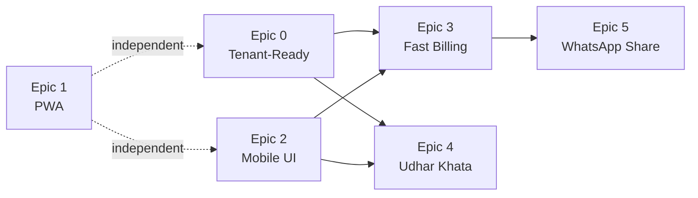

# MSME Bookkeeping Platform — Epic Breakdown (Part 2/2)

> **Audience**: Starter-level developer. Every instruction is exact.  
> **Read Part 1 first** for Epics 0-2 (Tenant, PWA, UI Shell).

---

# Epic 3: Fast Billing Engine

**Goal**: Redesign the bill creation flow for speed. Target: repeat-customer invoice in < 10 seconds and < 3 taps. Add a "Quick Bill" mode for non-itemized bills.

**Depends on**: Epic 0 (tenantId), Epic 2 (bottom sheet)

## Feature Overview

```
┌──────────────────────────────────────────────┐
│ Two billing modes:                           │
│                                              │
│ 1. QUICK BILL (new)                          │
│    Party → Amount → Done                     │
│    No line items, no template required        │
│    For small cash transactions               │
│                                              │
│ 2. DETAILED BILL (existing, improved)        │
│    Party → Template → Add Items → Totals     │
│    Full line-item support                    │
│    Uses existing template system             │
└──────────────────────────────────────────────┘
```

---

## Task 3.1 — Quick Bill Bottom Sheet

### File: `src/components/bills/QuickBillSheet.tsx` (NEW)

This is a bottom sheet form with exactly 4 fields. No more.

**Props:**

```typescript
interface QuickBillSheetProps {
  isOpen: boolean;
  onClose: () => void;
  onBillCreated: (bill: { id: string; billNumber: string }) => void;
}
```

**Form fields (in order of display):**

| # | Field | Type | Required | Source |
|---|-------|------|----------|--------|
| 1 | Party | Searchable select | Yes | `/api/parties?type=CUSTOMER` |
| 2 | Amount (₹) | Number input | Yes | User types |
| 3 | Description | Single-line text | No | User types (e.g., "Hardware supplies") |
| 4 | Payment Mode | 4-button toggle | No | CASH / UPI / BANK / CHEQUE (default: CASH) |

**UI Layout:**

```
┌────────────────────────────────────┐
│ ─── (drag handle)                  │
│                                    │
│  Quick Bill                        │
│                                    │
│  👤 [Search party...         ▼]    │
│                                    │
│  ₹  [Enter amount            ]    │
│      ↑ BIG font, auto-focus        │
│                                    │
│  📝 [Description (optional)  ]    │
│                                    │
│  [CASH] [UPI] [BANK] [CHEQUE]     │
│   ^^^ selected = filled button     │
│                                    │
│  [━━━━ Create Bill ₹12,000 ━━━━]  │
│  ^^^ primary button, full width    │
│  ^^^ shows amount in button text   │
│                                    │
└────────────────────────────────────┘
```

**Behavior:**

1. When party is selected, auto-fetch their last bill to pre-populate description
2. Amount input: large font (text-3xl), auto-focus, numeric keyboard on mobile (`inputMode="decimal"`)
3. On submit: POST to `/api/bills` with a default template (`__QUICK_BILL__`)
4. On success: close sheet, show toast with bill number, call `onBillCreated`
5. On error: show inline error, don't close sheet

**API call on submit:**

```typescript
const response = await fetch("/api/bills", {
  method: "POST",
  headers: { "Content-Type": "application/json" },
  body: JSON.stringify({
    templateId: "__QUICK_BILL__",  // Special marker for quick bills
    partyId: selectedParty.id,
    customerName: selectedParty.name,
    customerPhone: selectedParty.phone,
    rows: [{ description: description || "Quick Bill", amount: amount }],
    subtotal: amount,
    taxPercent: 0,   // Quick bills don't auto-add tax
    taxAmount: 0,
    grandTotal: amount,
    status: "FINAL",  // Quick bills are always finalized immediately
    paymentMode: selectedMode,  // Used to auto-create a payment record
  }),
});
```

### ⛔ DO NOT:
- Add tax calculation to Quick Bill — the shopkeeper entered the total, that IS the total
- Show template selection — Quick Bill uses a hardcoded template
- Allow DRAFT status — Quick Bills are always FINAL
- Add more than 4 fields — cognitive load kills adoption
- Use a full-page route — this MUST be a bottom sheet opened from any page

---

## Task 3.2 — Quick Bill API support

### File: `src/app/api/bills/route.ts` — Modify POST handler

Add this block BEFORE the existing `if (!templateId)` validation (around line 121):

```typescript
// Handle Quick Bill
const isQuickBill = templateId === "__QUICK_BILL__";

if (isQuickBill) {
  if (!partyId) {
    return NextResponse.json(
      { error: "Party is required for Quick Bill" },
      { status: 400 }
    );
  }

  if (!grandTotal || grandTotal <= 0) {
    return NextResponse.json(
      { error: "Amount must be greater than zero" },
      { status: 400 }
    );
  }

  // Quick Bill uses a system template
  // First, ensure the system template exists
  let quickTemplate = await prisma.billTemplate.findFirst({
    where: { name: "__QUICK_BILL__", tenantId },
  });

  if (!quickTemplate) {
    quickTemplate = await prisma.billTemplate.create({
      data: {
        tenantId,
        name: "__QUICK_BILL__",
        columns: [
          { name: "Description", type: "text" },
          { name: "Amount", type: "number" },
        ],
        createdBy: userId!,
      },
    });
  }

  // Override templateId for the rest of the flow
  body.templateId = quickTemplate.id;
}
```

Also add after the bill is created (around line 214), if `paymentMode` is provided:

```typescript
// Auto-create payment record for Quick Bills
if (isQuickBill && body.paymentMode) {
  await tx.payment.create({
    data: {
      tenantId,
      partyId: party.id,
      direction: party.type === "CUSTOMER" ? "INCOMING" : "OUTGOING",
      amount: resolvedGrandTotal,
      date: now,
      mode: body.paymentMode,
      status: "COMPLETED",
      linkedBillId: createdBill.id,
      createdBy: userId!,
    },
  });

  // Update party balance for the payment too
  const paymentDelta = getPaymentBalanceDelta(
    party.type,
    party.type === "CUSTOMER" ? "INCOMING" : "OUTGOING",
    resolvedGrandTotal
  );
  await tx.party.update({
    where: { id: party.id },
    data: { currentBalance: { increment: paymentDelta } },
  });
}
```

### ⛔ DO NOT:
- Change the existing detailed bill creation flow — Quick Bill is additive
- Skip the party balance update — accounting must stay consistent
- Allow Quick Bill without a party — every transaction needs a party for the ledger

---

## Task 3.3 — Party Searchable Select Component

### File: `src/components/ui/PartySearch.tsx` (NEW)

A reusable component used in both Quick Bill and detailed bill creation.

**Props:**

```typescript
interface PartySearchProps {
  value: string | null;           // Selected party ID
  onChange: (party: PartyOption | null) => void;
  partyType?: "CUSTOMER" | "VENDOR" | null;  // Filter by type
  placeholder?: string;
  autoFocus?: boolean;
}

interface PartyOption {
  id: string;
  name: string;
  phone: string | null;
  type: string;
  currentBalance: number;
}
```

**Behavior:**

1. Fetch parties from `/api/parties?limit=100` on mount (cache locally)
2. Filter client-side as user types (instant, no API calls per keystroke)
3. Show: Party name, phone, balance (color: green if positive, red if negative)
4. If no results, show "Add New Party" button that opens the party creation sheet
5. Use HeroUI `Autocomplete` component

**Display format for each option:**

```
┌──────────────────────────────────────┐
│ Rajesh Hardware           ₹-12,500  │
│ 📱 9876543210              To Pay ↗ │
└──────────────────────────────────────┘
```

### ⛔ DO NOT:
- Make an API call on every keystroke — fetch all parties once and filter locally
- Show inactive/deleted parties — filter `isActive: true, isDeleted: false`
- Allow selecting a party without showing their balance — the shopkeeper needs context

---

## Task 3.4 — Improved Detailed Bill Page

### File: `src/app/(app)/bills/new/page.tsx` — Modify

Changes to the EXISTING bill creation page:

1. **Pre-select party** if `?partyId=xxx` query param is present
2. **Pre-select template** if only one template exists
3. **Auto-focus** the first row's first editable column after template selection
4. **Inline totals** — show running subtotal as user fills rows (no need to scroll down)
5. **"Add Row" button** should be always visible, not hidden behind scroll

### New query param handling:

```typescript
const searchParams = useSearchParams();
const preselectedPartyId = searchParams.get("partyId");

useEffect(() => {
  if (preselectedPartyId && parties.length > 0) {
    const party = parties.find(p => p.id === preselectedPartyId);
    if (party) setSelectedParty(party);
  }
}, [preselectedPartyId, parties]);
```

### ⛔ DO NOT:
- Remove any existing bill creation functionality
- Change the bill number generation logic
- Change the template column system
- Move bill creation to a bottom sheet — detailed bills need a full page

---

## Task 3.5 — Bill Action Bar (shared component)

### File: `src/components/bills/BillActionBar.tsx` (NEW)

A floating action bar shown at the bottom of the bill detail page.

```typescript
interface BillActionBarProps {
  bill: {
    id: string;
    billNumber: string;
    customerName: string;
    grandTotal: number;
    status: string;
    customerPhone?: string | null;
  };
}
```

**Layout:**

```
┌─────────────────────────────────────────────┐
│ Fixed bottom bar, above bottom nav          │
│                                             │
│  [📱 Share]   [🖨 Print]   [💰 Payment]    │
│                                             │
└─────────────────────────────────────────────┘
```

- **Share**: Triggers WhatsApp sharing (see Epic 5)
- **Print**: Opens `window.print()` (existing print CSS)
- **Payment**: Opens payment recording bottom sheet pre-filled with bill info

### ⛔ DO NOT:
- Show "Payment" if bill status is CANCELLED
- Show "Share" if bill status is DRAFT
- Overlap with the mobile bottom nav — add `bottom: 80px` on mobile

---

## Task 3.6 — Smart Bill Number Generation

### File: `src/app/api/bills/route.ts` — Verify/update

The current bill number format is: `{PREFIX}-{YYYYMM}-{NNN}`

**Changes required:**
- Bill number count must be scoped by `tenantId` (not global):

```typescript
const existingCount = await tx.bill.count({
  where: {
    tenantId,  // ADD THIS
    createdAt: {
      gte: monthStart,
      lt: nextMonthStart,
    },
  },
});
```

This ensures Tenant A gets `BILL-202603-001` and Tenant B also gets `BILL-202603-001`.

---

# Epic 4: Udhar Khata (Party Ledger Chat View)

**Goal**: Add a WhatsApp-style chat interface to the party profile page. Each "message" is a bill or payment. The running balance is prominently displayed. Reminders can be sent via WhatsApp.

**Depends on**: Epic 0 (tenantId), Epic 2 (mobile UI)

## Task 4.1 — Chat-Style Ledger Component

### File: `src/components/parties/LedgerChat.tsx` (NEW)

**Props:**

```typescript
import { PartyLedgerEntry } from "@/lib/accounting";

interface LedgerChatProps {
  partyName: string;
  partyType: "CUSTOMER" | "VENDOR";
  partyPhone: string | null;
  currentBalance: number;
  ledger: PartyLedgerEntry[];
}
```

**Layout:**

```
┌──────────────────────────────────────────┐
│ ← Rajesh Hardware                        │
│                                          │
│ ┌────────────────────────────────────┐   │
│ │ BALANCE HEADER (sticky)            │   │
│ │                                    │   │
│ │    ₹12,500                         │   │
│ │    ↑ HUGE font (text-4xl)          │   │
│ │    ↑ RED if you owe / GREEN if     │   │
│ │      they owe you                  │   │
│ │                                    │   │
│ │    "You will receive ₹12,500"      │   │
│ │    ↑ Vernacular label              │   │
│ │                                    │   │
│ │  [📲 Send Reminder]               │   │
│ │  ↑ Only if balance < 0            │   │
│ └────────────────────────────────────┘   │
│                                          │
│ ── Mar 2026 ──────────────────────────   │
│                                          │
│      ┌─────────────────────┐             │
│      │ Bill #BILL-202603-001│ ← RIGHT   │
│      │ ₹8,500              │   (Money   │
│      │ 15 Mar              │    OUT =    │
│      └─────────────────────┘   you gave) │
│                                          │
│  ┌─────────────────────┐                 │
│  │ Payment Received    │ ← LEFT          │
│  │ ₹5,000 (UPI)        │   (Money        │
│  │ 20 Mar              │    IN =         │
│  └─────────────────────┘   you received) │
│                                          │
│ ── Opening Balance ───────────────────   │
│  ┌─────────────────────┐                 │
│  │ Opening: ₹0         │ ← CENTER       │
│  └─────────────────────┘                 │
│                                          │
│ ┌────────────────────────────────────┐   │
│ │  [+ Bill]        [+ Payment]       │   │
│ │  ↑ Floating action bar at bottom   │   │
│ └────────────────────────────────────┘   │
└──────────────────────────────────────────┘
```

**Message bubble styling rules:**

| Entry Type | Alignment | Background Color | Icon |
|---|---|---|---|
| BILL (Customer party) | Right | `bg-red-50 dark:bg-red-950/30` | 📄 |
| BILL (Vendor party) | Left | `bg-red-50 dark:bg-red-950/30` | 📄 |
| PAYMENT (INCOMING) | Left | `bg-green-50 dark:bg-green-950/30` | 💰 |
| PAYMENT (OUTGOING) | Right | `bg-green-50 dark:bg-green-950/30` | 💰 |
| OPENING | Center | `bg-default-100` | — |

**The rule is simple**: Money coming TO you = Left (green). Money going FROM you = Right (red).

For a CUSTOMER party:
- Bill = you gave goods = money going out = RIGHT (red)
- Payment received = money coming in = LEFT (green)

For a VENDOR party:
- Bill = you received goods = money going out = RIGHT (red)  
- Payment paid = money going out = RIGHT (red, but payment bubble)

**Key implementation details:**

```tsx
// Determine alignment for each entry
function getAlignment(entry: PartyLedgerEntry, partyType: string): "left" | "right" | "center" {
  if (entry.type === "OPENING") return "center";
  
  if (entry.type === "BILL") {
    // Bills always represent goods exchanged — money going OUT for the party viewing
    return "right";
  }
  
  if (entry.type === "PAYMENT") {
    // Incoming = money TO us = left
    // Outgoing = money FROM us = right
    return entry.credit > 0 ? "left" : "right";
  }
  
  return "center";
}

// Color coding
function getBubbleColor(entry: PartyLedgerEntry): string {
  if (entry.type === "OPENING") return "bg-default-100";
  if (entry.type === "PAYMENT" && entry.credit > 0) return "bg-green-50 dark:bg-green-950/30";
  return "bg-red-50 dark:bg-red-950/30";
}
```

**Date grouping**: Group entries by month. Show month headers like `── Mar 2026 ──`.

```typescript
// Group ledger entries by month
const groupedEntries = useMemo(() => {
  const groups: Map<string, PartyLedgerEntry[]> = new Map();
  
  // Reverse to show newest at top (like WhatsApp)
  const reversed = [...ledger].reverse();
  
  for (const entry of reversed) {
    const key = new Intl.DateTimeFormat("en-IN", {
      month: "short",
      year: "numeric",
    }).format(entry.date);
    
    if (!groups.has(key)) groups.set(key, []);
    groups.get(key)!.push(entry);
  }
  
  return groups;
}, [ledger]);
```

### ⛔ DO NOT:
- Use a table layout — this must look like a chat, not a spreadsheet
- Show debit/credit columns — the user must never see those words
- Show the ledger in ascending order — newest entries at TOP (like WhatsApp)
- Make it scrollable horizontally — single column, vertical scroll only
- Use the existing `PartyProfileClient` table layout — replace it

---

## Task 4.2 — Balance Header Component

### File: `src/components/parties/BalanceHeader.tsx` (NEW)

```typescript
interface BalanceHeaderProps {
  partyName: string;
  partyType: "CUSTOMER" | "VENDOR";
  currentBalance: number;
  partyPhone: string | null;
}
```

**Display logic:**

```typescript
function getBalanceLabel(partyType: string, balance: number, t: TranslatorFn): string {
  if (balance === 0) return t("khata.settled");  // "Settled" / "हिसाब बराबर"
  
  if (partyType === "CUSTOMER") {
    return balance < 0
      ? t("khata.youWillGet")   // "You will get" / "आपको मिलेगा"
      : t("khata.youWillGive"); // "You will give" / "आपको देना है"
  }
  
  // Vendor
  return balance < 0
    ? t("khata.youWillGive")
    : t("khata.youWillGet");
}

function getBalanceColor(partyType: string, balance: number): string {
  if (balance === 0) return "text-default-500";
  
  // Green = they owe you (you will GET money)
  // Red = you owe them (you will GIVE money)
  if (partyType === "CUSTOMER") {
    return balance < 0 ? "text-green-600" : "text-red-600";
  }
  return balance < 0 ? "text-red-600" : "text-green-600";
}
```

### New translation keys to add in `translations.ts`:

```typescript
// English
"khata.settled": "All settled ✓",
"khata.youWillGet": "You will get",
"khata.youWillGive": "You will give",
"khata.sendReminder": "Send Reminder",
"khata.noTransactions": "No transactions yet",
"khata.openingBalance": "Opening Balance",

// Hindi
"khata.settled": "हिसाब बराबर ✓",
"khata.youWillGet": "आपको मिलेगा",
"khata.youWillGive": "आपको देना है",
"khata.sendReminder": "रिमाइंडर भेजें",
"khata.noTransactions": "अभी कोई लेनदेन नहीं",
"khata.openingBalance": "शुरुआती बैलेंस",
```

---

## Task 4.3 — Wire into Party Profile Page

### File: `src/app/(app)/parties/[id]/PartyProfileClient.tsx` — Modify

Replace the existing table-based ledger with the new `LedgerChat` component.

**Before**: A `<table>` showing Date, Description, Debit, Credit, Balance columns  
**After**: The `<LedgerChat>` component from Task 4.1

The existing server-side data fetching in `page.tsx` already provides `ledger` and `calculatedCurrent` — no API changes needed.

```tsx
import LedgerChat from "@/components/parties/LedgerChat";
import BalanceHeader from "@/components/parties/BalanceHeader";

// Replace the ledger table section with:
<BalanceHeader
  partyName={party.name}
  partyType={party.type}
  currentBalance={calculatedCurrent}
  partyPhone={party.phone}
/>

<LedgerChat
  partyName={party.name}
  partyType={party.type}
  partyPhone={party.phone}
  currentBalance={calculatedCurrent}
  ledger={ledger}
/>
```

### ⛔ DO NOT:
- Remove the party details section (name, phone, address, GSTIN)
- Remove the edit party functionality
- Remove the measurements section for the party
- Change the data fetching in `page.tsx` (server component)

---

## Task 4.4 — Quick Actions from Ledger

At the bottom of the LedgerChat, add two action buttons:

```tsx
<div className="sticky bottom-0 p-4 bg-background/90 backdrop-blur border-t border-divider flex gap-3">
  <Button
    className="flex-1"
    color="danger"
    variant="flat"
    onPress={() => router.push(`/bills/new?partyId=${partyId}`)}
  >
    📄 {t("bills.new")}
  </Button>
  <Button
    className="flex-1"
    color="success"
    variant="flat"
    onPress={() => router.push(`/payments/new?partyId=${partyId}`)}
  >
    💰 {t("payments.record")}
  </Button>
</div>
```

---

# Epic 5: WhatsApp Sharing + UPI Links

**Goal**: Share bills via WhatsApp with an embedded UPI payment link. Use the Web Share API where available, fall back to WhatsApp deep links.

**Depends on**: Epic 3 (bill creation)

## Task 5.1 — Share Bill Function

### File: `src/lib/share.ts` (NEW)

```typescript
interface ShareBillOptions {
  billNumber: string;
  customerName: string;
  grandTotal: number;
  customerPhone?: string | null;
  companyName: string;
  companyUpiId?: string | null;  // e.g., "merchant@upi"
  billUrl: string;  // permalink to the bill
}

/**
 * Shares a bill via Web Share API (if available) or WhatsApp deep link.
 * Returns true if shared successfully.
 */
export async function shareBill(options: ShareBillOptions): Promise<boolean> {
  const {
    billNumber,
    customerName,
    grandTotal,
    customerPhone,
    companyName,
    companyUpiId,
    billUrl,
  } = options;

  const formattedAmount = new Intl.NumberFormat("en-IN", {
    style: "currency",
    currency: "INR",
    maximumFractionDigits: 0,
  }).format(grandTotal);

  // Build message
  let message = `🧾 *Bill from ${companyName}*\n\n`;
  message += `Bill No: ${billNumber}\n`;
  message += `Amount: *${formattedAmount}*\n`;
  message += `\n📋 View Bill: ${billUrl}\n`;

  // Add UPI payment link if available
  if (companyUpiId && grandTotal > 0) {
    const upiLink = buildUpiLink({
      pa: companyUpiId,
      pn: companyName,
      am: grandTotal.toFixed(2),
      tn: `Payment for ${billNumber}`,
      cu: "INR",
    });
    message += `\n💳 Pay Now: ${upiLink}\n`;
  }

  // Try Web Share API first
  if (typeof navigator !== "undefined" && navigator.share) {
    try {
      await navigator.share({
        title: `Bill ${billNumber}`,
        text: message,
      });
      return true;
    } catch (err) {
      // User cancelled or API not supported for text
      if ((err as Error).name === "AbortError") return false;
    }
  }

  // Fallback: WhatsApp deep link
  const whatsappUrl = buildWhatsAppUrl(message, customerPhone);
  window.open(whatsappUrl, "_blank");
  return true;
}

function buildUpiLink(params: {
  pa: string;  // payee address (UPI ID)
  pn: string;  // payee name
  am: string;  // amount
  tn: string;  // transaction note
  cu: string;  // currency
}): string {
  const query = new URLSearchParams(params).toString();
  return `upi://pay?${query}`;
}

function buildWhatsAppUrl(message: string, phone?: string | null): string {
  const encoded = encodeURIComponent(message);
  if (phone) {
    // Remove non-digits, add India country code if not present
    const cleaned = phone.replace(/\D/g, "");
    const withCode = cleaned.startsWith("91") ? cleaned : `91${cleaned}`;
    return `https://wa.me/${withCode}?text=${encoded}`;
  }
  return `https://wa.me/?text=${encoded}`;
}
```

### ⛔ DO NOT:
- Use `whatsapp://` protocol — `wa.me` works on both mobile and desktop
- Hard-code the UPI ID — it comes from Tenant settings
- Generate QR codes — that's a Phase 2 feature
- Share the bill as a PDF attachment — text message only for Phase 1

---

## Task 5.2 — Add UPI ID to Tenant Settings

### File: `prisma/schema.prisma`

No schema change needed — UPI ID is stored in the `Tenant.settings` JSON field.

### Update the TenantSettings interface:

```typescript
// In src/lib/tenant.ts or a shared types file
interface TenantSettings {
  billPrefix: string;
  defaultTaxPercent: number;
  defaultTerms: string;
  upiId?: string;  // NEW: e.g., "shopname@upi"
}
```

### File: `src/app/(app)/settings/company/page.tsx` — Add UPI ID field

Add a new input field in the company settings form:

```tsx
<Input
  label="UPI ID"
  placeholder="yourshop@upi"
  description="Payment link will be included when sharing bills"
  value={settings.upiId || ""}
  onValueChange={(val) => setSettings({ ...settings, upiId: val })}
/>
```

---

## Task 5.3 — Share Button on Bill Detail Page

### File: `src/app/(app)/bills/[id]/page.tsx` — Add share action

Use the `BillActionBar` component from Task 3.5, or add directly:

```tsx
import { shareBill } from "@/lib/share";

// Inside component:
async function handleShare() {
  const tenant = await fetch("/api/settings").then(r => r.json());
  const settings = tenant.settings || {};
  
  await shareBill({
    billNumber: bill.billNumber,
    customerName: bill.customerName,
    grandTotal: bill.grandTotal,
    customerPhone: bill.customerPhone,
    companyName: tenant.name || "My Business",
    companyUpiId: settings.upiId,
    billUrl: `${window.location.origin}/bills/${bill.id}`,
  });
}
```

### ⛔ DO NOT:
- Share bills that are in DRAFT status — only FINAL bills can be shared
- Auto-share on bill creation — sharing must be an explicit user action
- Include sensitive data (GSTIN, address) in the WhatsApp message — keep it minimal

---

## Task 5.4 — Public Bill Permalink (Optional Phase 1 Enhancement)

### File: `src/app/api/bills/[id]/public/route.ts` (NEW)

A public, unauthenticated route that returns bill data for the shareable link.

```typescript
import { prisma } from "@/lib/prisma";
import { NextRequest, NextResponse } from "next/server";

// GET /api/bills/:id/public — Public bill view (no auth required)
export async function GET(
  request: NextRequest,
  { params }: { params: Promise<{ id: string }> }
) {
  const { id } = await params;
  
  const bill = await prisma.bill.findFirst({
    where: { id, status: "FINAL", isDeleted: false },
    select: {
      billNumber: true,
      customerName: true,
      grandTotal: true,
      rows: true,
      subtotal: true,
      taxPercent: true,
      taxAmount: true,
      notes: true,
      terms: true,
      createdAt: true,
    },
  });
  
  if (!bill) {
    return NextResponse.json({ error: "Bill not found" }, { status: 404 });
  }
  
  return NextResponse.json({ bill });
}
```

### Middleware change for public access:

### File: `src/middleware.ts`

Add to the `PUBLIC_PATHS` array:

```typescript
const PUBLIC_PATHS = [
  "/login",
  "/api/auth/login",
  "/api/health",
  "/api/bills/*/public",  // Public bill view
];
```

Update the path matching to support wildcards:

```typescript
if (
  PUBLIC_PATHS.some((p) => {
    if (p.includes("*")) {
      const regex = new RegExp("^" + p.replace(/\*/g, "[^/]+") + "$");
      return regex.test(pathname);
    }
    return pathname.startsWith(p);
  }) ||
  pathname.startsWith("/_next") || ...
)
```

### ⛔ DO NOT:
- Expose customer phone or address on the public bill
- Allow editing from the public view
- Include tenant-internal data (templateId, createdBy, partyId)
- Skip the `status: "FINAL"` check — only finalized bills are public

---

# Appendix: Epic Dependency Matrix



**Parallel tracks:**
- Developer A: Epic 0 (Tenant) → Epic 3 (Billing) → Epic 5 (Share)
- Developer B: Epic 1 (PWA) + Epic 2 (UI Shell) → Epic 4 (Udhar Khata)

---

# Appendix: Complete New File List

| File | Epic | Type |
|------|------|------|
| `prisma/seed-tenant.ts` | 0 | Script |
| `src/lib/tenant.ts` | 0 | Utility |
| `public/manifest.json` | 1 | Config |
| `public/sw.js` | 1 | Service Worker |
| `public/icons/icon-192.png` | 1 | Asset |
| `public/icons/icon-512.png` | 1 | Asset |
| `src/hooks/useInstallPrompt.ts` | 1 | Hook |
| `src/components/ui/BottomSheet.tsx` | 2 | Component |
| `src/components/bills/QuickBillSheet.tsx` | 3 | Component |
| `src/components/bills/BillActionBar.tsx` | 3 | Component |
| `src/components/ui/PartySearch.tsx` | 3 | Component |
| `src/components/parties/LedgerChat.tsx` | 4 | Component |
| `src/components/parties/BalanceHeader.tsx` | 4 | Component |
| `src/lib/share.ts` | 5 | Utility |
| `src/app/api/bills/[id]/public/route.ts` | 5 | API Route |

# Appendix: Modified File List

| File | Epics |
|------|-------|
| `prisma/schema.prisma` | 0 |
| `.env` | 0 |
| `src/middleware.ts` | 0, 5 |
| `src/app/layout.tsx` | 1 |
| `src/app/(app)/AppShellWrapper.tsx` | 1 |
| `src/components/ui/AppShell.tsx` | 2 |
| `src/app/globals.css` | 2 |
| `src/lib/i18n/translations.ts` | 2, 4 |
| `src/app/api/bills/route.ts` | 0, 3 |
| `src/app/api/parties/route.ts` | 0 |
| `src/app/api/payments/route.ts` | 0 |
| All other `src/app/api/*/route.ts` | 0 |
| `src/app/(app)/parties/[id]/PartyProfileClient.tsx` | 4 |
| `src/app/(app)/bills/[id]/page.tsx` | 5 |
| `src/app/(app)/settings/company/page.tsx` | 5 |
| `src/app/(app)/dashboard/page.tsx` | 1 |
