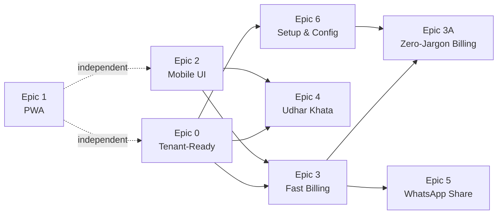

# MSME Bookkeeping Platform — Supplementary Epics (Part 3)

> **Audience**: Starter-level developer. Every instruction is exact.  
> **Read Part 1 & 2 first** for Epics 0-5.  
> **This document covers**:  
> - Epic 3A: Zero-Jargon Billing Flow (auto-populate from Party records)  
> - Epic 6: Setup & Configuration Modules

---

# Epic 3A: Zero-Jargon Billing Flow

**Goal**: The billing form must NEVER expose GSTIN, customer phone, customer address, or editable customer name to the daily user. All of this is auto-populated from the Party record. The billing flow becomes: **Pick Party → Add Items → Done.**

**Depends on**: Epic 0 (tenantId), Epic 3 (billing engine)

> [!IMPORTANT]
> This epic modifies the **existing** bill creation page (`src/app/(app)/bills/new/page.tsx`). It runs AFTER Epic 3 tasks are complete.

---

## The Problem Today

The current bill form (`bills/new/page.tsx`, lines 399-478) shows this "Bill To" card:

```
┌─────────────────────────────────────┐
│ Bill To                             │
│                                     │
│ [Party dropdown        ▼]          │
│                                     │
│ [Customer Name    ] [Phone       ]  │  ← EXPOSED (editable)
│ [Address          ] [GSTIN       ]  ← EXPOSED (editable)
│                                     │
│ "This snapshot is stored on the     │
│  bill even if the party changes"    │
└─────────────────────────────────────┘
```

**After this epic, it becomes:**

```
┌─────────────────────────────────────┐
│ Bill To                             │
│                                     │
│ 👤 [Search customer...        🔍]  │
│                                     │
│ ┌─ Rajesh Hardware ─────────────┐  │
│ │ 📱 9876543210                 │  │  ← READ-ONLY preview
│ │ 📍 Nehru Road, Dhule          │  │  ← auto-populated
│ │ GSTIN: 27AABCT1234F1ZV        │  │  ← auto-populated
│ │ Balance: ₹-12,500 (to pay)   │  │  ← contextual info
│ └───────────────────────────────┘  │
│                                     │
│ No fields to edit. All data comes   │
│ from the Party record.              │
└─────────────────────────────────────┘
```

---

## Task 3A.1 — Remove Editable Customer Fields from Bill Form

### File: `src/app/(app)/bills/new/page.tsx`

**DELETE these state variables** (lines 89-92):

```typescript
// DELETE THESE LINES:
const [customerName, setCustomerName] = useState("");
const [customerPhone, setCustomerPhone] = useState("");
const [customerAddress, setCustomerAddress] = useState("");
const [gstin, setGstin] = useState("");
```

**REPLACE with** a selected party object:

```typescript
const [selectedParty, setSelectedParty] = useState<PartyOption | null>(null);
```

**DELETE the `applyPartySnapshot` function** (lines 136-152) entirely.

**REPLACE the "Bill To" card** (lines 399-480) with:

```tsx
<Card shadow="sm" className="mb-6">
  <CardHeader className="px-6 pt-6 pb-0">
    <h2 className="text-lg font-semibold">{t("bills.billTo")}</h2>
  </CardHeader>
  <CardBody className="p-6">
    {/* Party search — the ONLY input the user interacts with */}
    <PartySearch
      value={selectedParty?.id || null}
      onChange={(party) => {
        setSelectedParty(party);
        if (party) {
          setErrors((prev) => ({ ...prev, partyId: false }));
        }
      }}
      partyType="CUSTOMER"
      autoFocus={!selectedParty}
      isInvalid={Boolean(errors.partyId)}
    />

    {/* Read-only party preview — shows AFTER party is selected */}
    {selectedParty && (
      <div className="mt-4 rounded-xl bg-default-50 dark:bg-default-100/5 p-4 border border-default-200">
        <div className="flex items-center justify-between mb-2">
          <h3 className="font-semibold text-lg">{selectedParty.name}</h3>
          <Button
            size="sm"
            variant="light"
            onPress={() => setSelectedParty(null)}
          >
            {t("common.change")}
          </Button>
        </div>
        
        <div className="space-y-1 text-sm text-default-500">
          {selectedParty.phone && (
            <p className="flex items-center gap-2">
              <span>📱</span> {selectedParty.phone}
            </p>
          )}
          {selectedParty.address && (
            <p className="flex items-center gap-2">
              <span>📍</span> {selectedParty.address}
            </p>
          )}
          {selectedParty.gstin && (
            <p className="flex items-center gap-2">
              <span className="text-xs font-mono">GST</span> {selectedParty.gstin}
            </p>
          )}
        </div>
        
        {/* Balance context */}
        {selectedParty.currentBalance !== 0 && (
          <div className={`mt-3 pt-3 border-t border-default-200 text-sm font-medium ${
            selectedParty.currentBalance < 0 ? "text-danger" : "text-success"
          }`}>
            {selectedParty.currentBalance < 0
              ? `${t("khata.youWillGet")} ₹${Math.abs(selectedParty.currentBalance).toLocaleString("en-IN")}`
              : `${t("khata.youWillGive")} ₹${selectedParty.currentBalance.toLocaleString("en-IN")}`
            }
          </div>
        )}
      </div>
    )}
  </CardBody>
</Card>
```

**UPDATE the `handleSave` function** — replace the body construction (lines 262-277):

```typescript
body: JSON.stringify({
  templateId: selectedTemplate.id,
  partyId: selectedParty.id,
  // Auto-populate from party record — user never typed these
  customerName: selectedParty.name,
  customerPhone: selectedParty.phone || null,
  customerAddress: selectedParty.address || null,
  gstin: selectedParty.gstin || null,
  rows,
  subtotal,
  taxPercent,   // Comes from tenant settings, not user input
  taxAmount,
  grandTotal,
  notes: notes.trim() || null,
  terms: terms.trim() || null,
  status,
}),
```

**UPDATE the validation** (lines 239-253):

```typescript
const formErrors: Record<string, boolean> = {};
if (!selectedParty) {
  formErrors.partyId = true;
}
// REMOVED: customerName validation — it auto-comes from party
```

### ⛔ DO NOT:
- Keep the customerName, customerPhone, customerAddress, gstin input fields in any form
- Allow editing the party details from the bill form — if they need to change party info, they go to Parties → Edit
- Add an "override" toggle to show the fields — that defeats the purpose
- Remove the snapshot data from the API payload — the backend still stores phone/address/gstin ON the bill for historical records

---

## Task 3A.2 — Auto-Calculate Tax from Tenant Settings

### Current behavior (lines 644-655):
The tax % is an **editable input field** that the user can change per-bill.

### New behavior:
Tax % is **auto-set from tenant settings** and shown as **read-only text**. The user should NEVER think about tax.

**REPLACE the Tax row in the Summary card** (line 643-655):

```tsx
{/* Tax — auto-calculated, NOT editable */}
<div className="flex items-center justify-between">
  <span className="text-default-500">
    Tax ({taxPercent}%)
  </span>
  <span className="font-medium">{formatCurrency(taxAmount)}</span>
</div>
```

**DELETE the `setTaxPercent` state setter from the JSX.** The `taxPercent` value is set once on load from tenant settings (line 117) and never changed by the user.

If a shopkeeper genuinely needs a different tax rate for a specific bill, the admin can change the default tax in Settings. But we do NOT expose this per-bill.

### ⛔ DO NOT:
- Remove the `taxPercent` state variable — it's still used for calculation
- Hard-code 18% — it must come from tenant settings
- Add an HSN code field to bill items yet — that's Phase 2 (for now, all items use the tenant's single default tax rate)

---

## Task 3A.3 — Auto-Select Template When Only One Exists

### File: `src/app/(app)/bills/new/page.tsx`

Most MSMEs will have exactly 1 bill template. Don't make them pick it every time.

**Add this after templates are loaded** (after line 113):

```typescript
// Auto-select template if only one exists
useEffect(() => {
  if (templates.length === 1 && !selectedTemplate) {
    selectTemplate(templates[0].id);
  }
}, [templates, selectedTemplate]);
```

**When auto-selected, skip the template selection card entirely:**

```tsx
{/* Only show template picker if multiple templates exist */}
{!selectedTemplate && templates.length > 1 && (
  <Card shadow="sm" className="mb-6">
    {/* ... existing template grid ... */}
  </Card>
)}
```

---

## Task 3A.4 — Update PartyOption Interface

The `PartySearch` component (from Epic 3, Task 3.3) and this page need the party to include `address` and `gstin` so we can display the read-only preview.

### Update the API response:

**File**: `src/app/api/parties/route.ts`

Ensure the GET response includes all fields needed for the preview:

```typescript
select: {
  id: true,
  name: true,
  type: true,
  phone: true,
  email: true,
  address: true,    // ENSURE INCLUDED
  gstin: true,      // ENSURE INCLUDED
  currentBalance: true,  // ENSURE INCLUDED
  isActive: true,
},
```

### Update PartyOption interface everywhere it's used:

```typescript
interface PartyOption {
  id: string;
  name: string;
  type: "CUSTOMER" | "VENDOR";
  phone: string | null;
  address: string | null;
  gstin: string | null;
  currentBalance: number;
}
```

---

## Task 3A.5 — New Translation Keys

### File: `src/lib/i18n/translations.ts`

```typescript
// English
"bills.billTo": "Bill To",
"bills.selectCustomer": "Search customer...",
"bills.autoTaxNote": "Tax is auto-calculated from your business settings",

// Hindi
"bills.billTo": "बिल प्राप्तकर्ता",
"bills.selectCustomer": "ग्राहक खोजें...",
"bills.autoTaxNote": "टैक्स आपकी बिज़नेस सेटिंग्स से ऑटो-कैलकुलेट होता है",
```

### Acceptance Criteria for Epic 3A:
- [ ] Bill creation form has NO editable GSTIN field
- [ ] Bill creation form has NO editable phone/address field
- [ ] Bill creation form has NO editable customer name field
- [ ] Party selection auto-populates a read-only preview card
- [ ] Tax % is read-only, auto-populated from tenant settings
- [ ] Single-template tenants skip template selection screen
- [ ] Backend still receives and stores phone/address/gstin on the bill
- [ ] Printed bill still shows full party details (phone, address, GSTIN)
- [ ] Bill flow for repeat customer: Pick party → Items already scoped → Save = 3 interactions

---

# Epic 6: Setup & Configuration

**Goal**: Build the configuration modules that the "Tech-Savvy Nephew" (setup person) uses ONCE to get the business running. These screens are admin-only and designed for a slightly more technical user.

**Depends on**: Epic 0 (tenantId)

---

## Feature Overview

```
Settings (Admin only)
├── 🏢 Business Profile       (Epic 6.1 — replaces CompanySettings)
│   ├── Company name, address, phone
│   ├── GSTIN
│   ├── Logo upload
│   └── UPI ID (for bill sharing)
│
├── 🧾 Billing Configuration  (Epic 6.2 — NEW)
│   ├── Bill number prefix
│   ├── Default tax rate (%)
│   ├── Default terms & conditions
│   └── Tax registration type toggle
│
├── 📦 Item Catalog           (Epic 6.3 — NEW)
│   ├── Add/edit/delete items
│   ├── Item name, HSN code, default rate, unit
│   └── Used for fast item search during billing
│
├── 👥 User Management        (Existing — needs tenant scoping)
│
├── 📋 Bill Templates         (Existing — needs tenant scoping)
│
└── 🔄 First-Time Onboarding  (Epic 6.4 — NEW wizard)
```

---

## Task 6.1 — Business Profile Page (Migrate CompanySettings)

### File: `src/app/(app)/settings/company/page.tsx` — Major rewrite

The current page reads from `CompanySettings` model. After Epic 0, it reads from the `Tenant` model.

**Changes:**

1. Rename page title from "Company Profile" to "Business Profile" (or "व्यापार प्रोफ़ाइल" in Hindi)
2. Replace all `companySettings` API calls with `tenant` API calls
3. Add UPI ID field (for WhatsApp bill sharing)
4. Add Business Type selector: `Individual / Partnership / Pvt Ltd / LLP`

**Updated form fields:**

| Section | Field | Type | Stored In |
|---------|-------|------|-----------|
| Business Details | Business Name | text | `tenant.name` |
| Business Details | Phone | tel | `tenant.phone` |
| Business Details | Email | email | `tenant.email` |
| Business Details | Address | textarea | `tenant.address` |
| Business Details | GSTIN | text | `tenant.gstin` |
| Business Details | Logo | file upload | `tenant.logoUrl` |
| Payment Details | UPI ID | text | `tenant.settings.upiId` |

**Settings API changes:**

### File: `src/app/api/settings/route.ts` — Rewrite

```typescript
import { prisma } from "@/lib/prisma";
import { getTenantId } from "@/lib/tenant";
import { NextRequest, NextResponse } from "next/server";

// GET /api/settings — Get tenant profile + settings
export async function GET() {
  const tenantId = await getTenantId();
  
  const tenant = await prisma.tenant.findUnique({
    where: { id: tenantId },
  });

  if (!tenant) {
    return NextResponse.json({ error: "Tenant not found" }, { status: 404 });
  }

  // Flatten settings for backward compatibility
  const settings = tenant.settings as Record<string, unknown> || {};
  
  return NextResponse.json({
    settings: {
      // Business profile (from tenant fields)
      companyName: tenant.name,
      companyPhone: tenant.phone,
      companyEmail: tenant.email,
      companyAddress: tenant.address,
      companyGstin: tenant.gstin,
      companyLogo: tenant.logoUrl,
      // Billing settings (from tenant.settings JSON)
      billPrefix: settings.billPrefix || "BILL",
      defaultTaxPercent: settings.defaultTaxPercent ?? 18,
      defaultTerms: settings.defaultTerms || "",
      upiId: settings.upiId || "",
    },
  });
}

// PATCH /api/settings — Update tenant profile + settings
export async function PATCH(request: NextRequest) {
  const role = request.headers.get("x-user-role");
  if (role !== "ADMIN") {
    return NextResponse.json({ error: "Forbidden" }, { status: 403 });
  }

  const tenantId = await getTenantId();
  const body = await request.json();

  const tenant = await prisma.tenant.update({
    where: { id: tenantId },
    data: {
      name: body.companyName ?? undefined,
      phone: body.companyPhone ?? undefined,
      email: body.companyEmail ?? undefined,
      address: body.companyAddress ?? undefined,
      gstin: body.companyGstin ?? undefined,
      logoUrl: body.companyLogo ?? undefined,
      settings: {
        billPrefix: body.billPrefix || "BILL",
        defaultTaxPercent: body.defaultTaxPercent ?? 18,
        defaultTerms: body.defaultTerms || "",
        upiId: body.upiId || "",
      },
    },
  });

  return NextResponse.json({ success: true, tenant });
}
```

### ⛔ DO NOT:
- Keep any reference to `CompanySettings` model in the codebase
- Expose `tenantId` or `slug` in the settings form — these are internal
- Allow non-ADMIN users to access the settings API

---

## Task 6.2 — Billing Configuration Section

This is a section within the Business Profile page, NOT a separate page.

**Add below the Business Details section in the company settings page:**

```tsx
<Card shadow="sm" className="mt-6">
  <CardHeader>
    <h2 className="text-lg font-semibold">🧾 {t("settings.billingConfig")}</h2>
  </CardHeader>
  <CardBody className="space-y-4 p-6">
    {/* Bill Prefix */}
    <Input
      label={t("company.billPrefix")}
      placeholder="e.g. BILL, INV, EST"
      description={t("company.billPrefixDescription")}
      value={billPrefix}
      onValueChange={setBillPrefix}
      variant="bordered"
    />
    
    {/* Default Tax Rate */}
    <Input
      type="number"
      label={t("company.defaultTax")}
      value={String(defaultTaxPercent)}
      onValueChange={(val) => setDefaultTaxPercent(val)}
      variant="bordered"
      endContent={<span className="text-default-400">%</span>}
      description={t("bills.autoTaxNote")}
    />
    
    {/* Default Terms */}
    <Textarea
      label={t("company.defaultTerms")}
      placeholder={t("company.defaultTermsPlaceholder")}
      value={defaultTerms}
      onValueChange={setDefaultTerms}
      variant="bordered"
      minRows={3}
    />
  </CardBody>
</Card>
```

---

## Task 6.3 — Item Catalog (NEW Feature)

### Purpose:
MSMEs sell the same products repeatedly. An item catalog allows instant item lookup during billing instead of typing from scratch.

### Prisma Schema Addition:

### File: `prisma/schema.prisma` — Add new model

```prisma
model ItemCatalog {
  id        String   @id @default(cuid())
  tenantId  String
  tenant    Tenant   @relation(fields: [tenantId], references: [id])
  name      String
  hsnCode   String?  // HSN/SAC code for GST (optional)
  unit      String   @default("pcs")  // pcs, kg, meter, sqft, etc.
  rate      Float    @default(0)      // Default selling price
  taxRate   Float?   // Item-specific tax rate (overrides tenant default if set)
  isActive  Boolean  @default(true)
  createdAt DateTime @default(now())
  updatedAt DateTime @updatedAt

  @@index([tenantId])
  @@index([tenantId, name])
}
```

Add `items ItemCatalog[]` to the `Tenant` model relations.

### API Route:

### File: `src/app/api/items/route.ts` (NEW)

```typescript
import { prisma } from "@/lib/prisma";
import { getTenantId } from "@/lib/tenant";
import { NextRequest, NextResponse } from "next/server";

// GET /api/items — List all items for the tenant
export async function GET() {
  const tenantId = await getTenantId();
  
  const items = await prisma.itemCatalog.findMany({
    where: { tenantId, isActive: true },
    orderBy: { name: "asc" },
  });

  return NextResponse.json({ items });
}

// POST /api/items — Create a new item
export async function POST(request: NextRequest) {
  const role = request.headers.get("x-user-role");
  if (role !== "ADMIN" && role !== "STAFF") {
    return NextResponse.json({ error: "Forbidden" }, { status: 403 });
  }

  const tenantId = await getTenantId();
  const body = await request.json();

  if (!body.name?.trim()) {
    return NextResponse.json({ error: "Item name is required" }, { status: 400 });
  }

  const item = await prisma.itemCatalog.create({
    data: {
      tenantId,
      name: body.name.trim(),
      hsnCode: body.hsnCode?.trim() || null,
      unit: body.unit || "pcs",
      rate: parseFloat(body.rate) || 0,
      taxRate: body.taxRate != null ? parseFloat(body.taxRate) : null,
    },
  });

  return NextResponse.json({ item }, { status: 201 });
}
```

### Settings Page: Item Catalog Management

### File: `src/app/(app)/settings/items/page.tsx` (NEW)

Display a simple list with inline add:

```
┌──────────────────────────────────────────────────┐
│ 📦 Item Catalog                    [+ Add Item]  │
│                                                   │
│ ┌────────┬────────┬──────┬────────┬─────────────┐│
│ │ Name   │ HSN    │ Unit │ Rate   │ Actions     ││
│ ├────────┼────────┼──────┼────────┼─────────────┤│
│ │ Flush  │ 4418   │ pcs  │ ₹850   │ [Edit] [🗑] ││
│ │ Item   │        │      │        │             ││
│ ├────────┼────────┼──────┼────────┼─────────────┤│
│ │ Handle │ 8302   │ pcs  │ ₹120   │ [Edit] [🗑] ││
│ ├────────┼────────┼──────┼────────┼─────────────┤│
│ │ Ply    │ 4412   │ sqft │ ₹45    │ [Edit] [🗑] ││
│ │ Board  │        │      │        │             ││
│ └────────┴────────┴──────┴────────┴─────────────┘│
│                                                   │
│ HSN codes are optional. They help your CA         │
│ with GST filing.                                  │
└──────────────────────────────────────────────────┘
```

**Fields per item:**

| Field | Type | Required | Description |
|-------|------|----------|-------------|
| Name | text | Yes | Product/service name. Free text allowed. |
| HSN Code | text | No | 4-8 digit HSN/SAC code. CA sets this up, not shopkeeper. |
| Unit | dropdown | Yes | Options: `pcs, kg, ltr, meter, sqft, box, set, pair, nos` |
| Default Rate (₹) | number | No | Pre-filled selling price. Can be overridden per bill. |
| Tax Rate (%) | number | No | If blank, uses tenant default. CA sets per-item rates. |

### ⛔ DO NOT:
- Require HSN codes — most shopkeepers don't know them. The CA fills them in later.
- Make this page a gatekeeper — billing should work even with ZERO items in the catalog
- Show this in the main navigation — it's under Settings only
- Add inventory/stock quantities here — that's a separate feature

---

## Task 6.4 — First-Time Onboarding Wizard

### Purpose:
When a new tenant has no data (no parties, no templates, no items), show a guided setup wizard instead of empty pages. This is for the "Tech-Savvy Nephew" persona.

### File: `src/components/onboarding/SetupWizard.tsx` (NEW)

**4-step wizard that appears only when the tenant is freshly created:**

```
Step 1: Business Details
┌──────────────────────────────────────┐
│ Welcome! Let's set up your business  │
│                                      │
│ [Business Name          ]            │
│ [Phone Number           ]            │
│ [GSTIN (optional)       ]            │
│                                      │
│              [Next →]                │
└──────────────────────────────────────┘

Step 2: Create Your First Template
┌──────────────────────────────────────┐
│ How do your bills look?              │
│                                      │
│ Choose a preset:                     │
│                                      │
│ ┌──────────┐  ┌──────────┐          │
│ │ Simple   │  │ Detailed │          │
│ │          │  │          │          │
│ │ Item     │  │ Item     │          │
│ │ Amount   │  │ Qty      │          │
│ │          │  │ Rate     │          │
│ │          │  │ Amount   │          │
│ └──────────┘  └──────────┘          │
│                                      │
│ [← Back]         [Next →]           │
└──────────────────────────────────────┘

Step 3: Add Your First Customer
┌──────────────────────────────────────┐
│ Who's your first customer?           │
│                                      │
│ [Customer Name          ]            │
│ [Phone Number           ]            │
│                                      │
│ [+ Add Another] or [Skip →]         │
│                                      │
│ [← Back]         [Next →]           │
└──────────────────────────────────────┘

Step 4: Done!
┌──────────────────────────────────────┐
│ 🎉 You're all set!                  │
│                                      │
│ Your first bill is just 3 taps      │
│ away.                                │
│                                      │
│        [Create Your First Bill →]    │
└──────────────────────────────────────┘
```

### Detection logic:

### File: `src/app/(app)/dashboard/page.tsx`

```typescript
// Check if tenant needs onboarding
const [showOnboarding, setShowOnboarding] = useState(false);

useEffect(() => {
  async function checkOnboarding() {
    const [partiesRes, templatesRes] = await Promise.all([
      fetch("/api/parties?limit=1"),
      fetch("/api/templates?limit=1"),
    ]);
    const [partiesData, templatesData] = await Promise.all([
      partiesRes.json(),
      templatesRes.json(),
    ]);

    // Show wizard if BOTH parties and templates are empty
    const noParties = !partiesData.parties?.length;
    const noTemplates = !templatesData.templates?.length;
    
    if (noParties && noTemplates) {
      setShowOnboarding(true);
    }
  }
  checkOnboarding();
}, []);

// In JSX:
if (showOnboarding) {
  return <SetupWizard onComplete={() => setShowOnboarding(false)} />;
}
```

### Template presets (created during onboarding):

**Simple preset:**
```json
{
  "name": "Simple Invoice",
  "columns": [
    { "id": "item", "name": "Item", "type": "text" },
    { "id": "amount", "name": "Amount", "type": "number" }
  ]
}
```

**Detailed preset:**
```json
{
  "name": "Detailed Invoice",
  "columns": [
    { "id": "item", "name": "Item", "type": "text" },
    { "id": "qty", "name": "Qty", "type": "number" },
    { "id": "rate", "name": "Rate", "type": "number" },
    { "id": "amount", "name": "Amount", "type": "formula", "formula": "{Qty} * {Rate}" }
  ]
}
```

### ⛔ DO NOT:
- Block the app behind onboarding — user must be able to dismiss/skip at any point
- Show onboarding after the first template or party is created — it's one-time only
- Ask too many questions — 4 steps maximum, each < 30 seconds
- Require GSTIN in onboarding — it's optional, the CA adds it later
- Create the onboarding as a separate route — it replaces the dashboard content conditionally

---

## Task 6.5 — Settings Navigation Updates

### File: `src/components/ui/AppShell.tsx`

Add Item Catalog to the settings navigation (both sidebar and "More" sheet):

**Desktop sidebar settings links — add after Templates link:**

```tsx
<button
  onClick={() => router.push("/settings/items")}
  className={`w-full flex items-center gap-3 px-3 py-2.5 rounded-xl transition-all duration-200 group ${
    pathname === "/settings/items"
      ? "bg-primary/10 text-primary font-semibold"
      : "text-default-600 hover:bg-default-100 hover:text-default-900"
  }`}
>
  <svg className="w-5 h-5 flex-shrink-0 text-default-400" fill="none" stroke="currentColor" viewBox="0 0 24 24">
    <path strokeLinecap="round" strokeLinejoin="round" strokeWidth={1.5}
      d="M20 7l-8-4-8 4m16 0l-8 4m8-4v10l-8 4m0-10L4 7m8 4v10M4 7v10l8 4" />
  </svg>
  {!sidebarCollapsed && <span className="truncate">{t("settings.items")}</span>}
</button>
```

### New translation keys:

```typescript
// English
"settings.items": "Item Catalog",
"settings.billingConfig": "Billing Configuration",
"settings.businessProfile": "Business Profile",
"items.title": "Item Catalog",
"items.subtitle": "Manage products and services for quick billing",
"items.add": "Add Item",
"items.name": "Item Name",
"items.nameRequired": "Item name is required",
"items.hsnCode": "HSN/SAC Code",
"items.hsnHelp": "Your CA can help with the right HSN codes for GST",
"items.unit": "Unit",
"items.rate": "Default Rate (₹)",
"items.taxRate": "Tax Rate (%)",
"items.taxRateHelp": "Leave blank to use business default",
"items.created": "Item added",
"items.updated": "Item updated",
"items.deleted": "Item removed",
"items.empty": "No items yet",
"items.emptyHint": "Add your products to speed up billing",

// Hindi
"settings.items": "आइटम सूची",
"settings.billingConfig": "बिलिंग कॉन्फ़िगरेशन",
"settings.businessProfile": "व्यापार प्रोफ़ाइल",
"items.title": "आइटम सूची",
"items.subtitle": "तेज़ बिलिंग के लिए उत्पाद और सेवाएं प्रबंधित करें",
"items.add": "आइटम जोड़ें",
"items.name": "आइटम का नाम",
"items.nameRequired": "आइटम का नाम आवश्यक है",
"items.hsnCode": "HSN/SAC कोड",
"items.hsnHelp": "सही HSN कोड के लिए अपने CA से पूछें",
"items.unit": "इकाई",
"items.rate": "डिफॉल्ट दर (₹)",
"items.taxRate": "टैक्स दर (%)",
"items.taxRateHelp": "खाली छोड़ने पर व्यापार की डिफॉल्ट दर लागू होगी",
"items.created": "आइटम जोड़ा गया",
"items.updated": "आइटम अपडेट किया गया",
"items.deleted": "आइटम हटाया गया",
"items.empty": "अभी कोई आइटम नहीं है",
"items.emptyHint": "बिलिंग तेज़ करने के लिए अपने उत्पाद जोड़ें",
```

---

## Acceptance Criteria for Epic 6:
- [ ] Settings page reads from `Tenant` model, not `CompanySettings`
- [ ] UPI ID can be saved and is used in WhatsApp sharing
- [ ] Item Catalog page allows CRUD operations on items
- [ ] Items have: name, HSN code (optional), unit, rate, tax rate (optional)
- [ ] Onboarding wizard appears for fresh tenants (no parties + no templates)
- [ ] Onboarding creates a preset template and first customer
- [ ] Onboarding can be skipped at any step
- [ ] Item catalog navigation appears in sidebar under Settings
- [ ] All settings pages are admin-only (middleware + API check)

---

# Updated Epic Dependency Matrix



# Updated File Manifest (new files from this document)

| File | Epic | Type |
|------|------|------|
| `src/app/api/items/route.ts` | 6 | API Route |
| `src/app/(app)/settings/items/page.tsx` | 6 | Page |
| `src/components/onboarding/SetupWizard.tsx` | 6 | Component |

# Updated Modified Files

| File | Epics |
|------|-------|
| `src/app/(app)/bills/new/page.tsx` | 3, 3A |
| `src/app/api/settings/route.ts` | 6 |
| `src/app/(app)/settings/company/page.tsx` | 6 |
| `src/app/(app)/dashboard/page.tsx` | 1, 6 |
| `src/components/ui/AppShell.tsx` | 2, 6 |
| `src/lib/i18n/translations.ts` | 2, 3A, 4, 6 |
| `prisma/schema.prisma` | 0, 6 |
